# Agenda

 Introduction
 CQRS
 RDBMS vs NoSQL
 Break Time
 Why and When NoSQL
 Demo

---

<!-- _class: lead -->

# Introduction

---

#### Kerem Can Kabadayı
---

#### Kerem Can Kabadayı
2 years at Trendyol as Software Developer

---

#### Kerem Can Kabadayı

2 years at Trendyol as Software Developer

---

#### Kerem Can Kabadayı

2 years at Trendyol as Software Developer

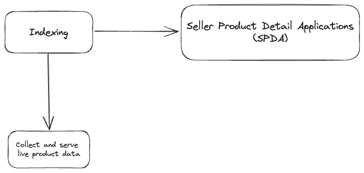 

---

###### SPDA, huh?
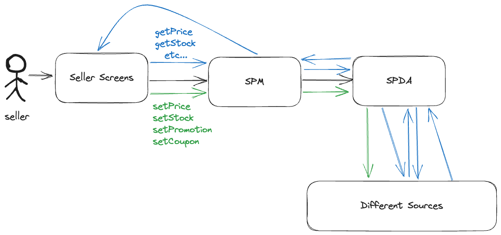

---

###### SPDA, huh?

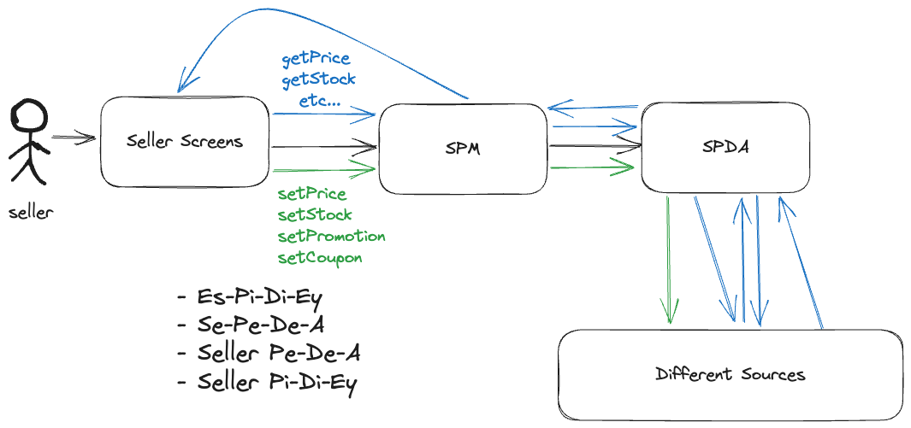 

---

<!-- _class: lead -->

# CQRS

---

- **Command Query Separation**, 1988 Bertrand Meyer.

---

- **Command Query Separation**, 1988 Bertrand Meyer.
- Command -> Changing state and return nothing

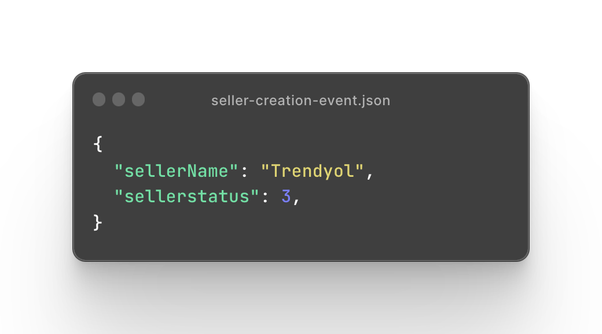 

---

- **Command Query Separation**, 1988 Bertrand Meyer.
- Command -> Changing state and return nothing

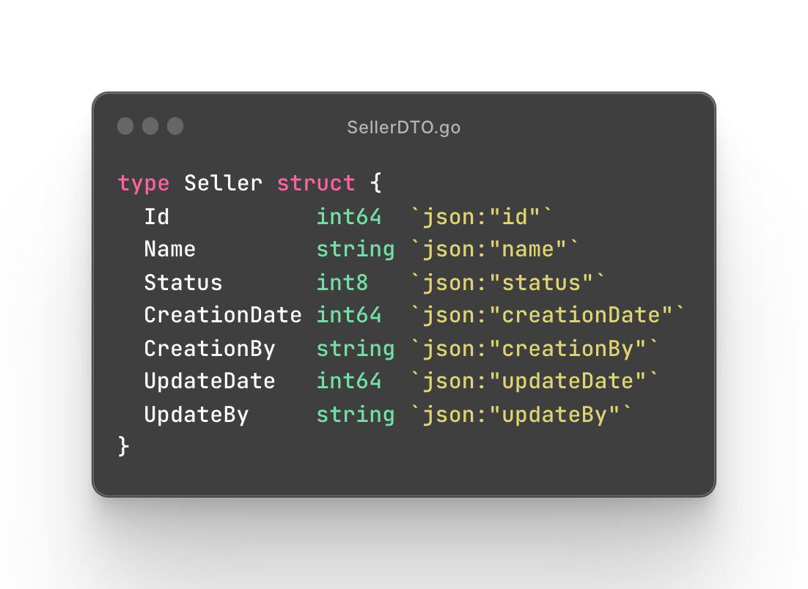

---

- **Command Query Separation**, 1988 Bertrand Meyer.
- Query -> Only read

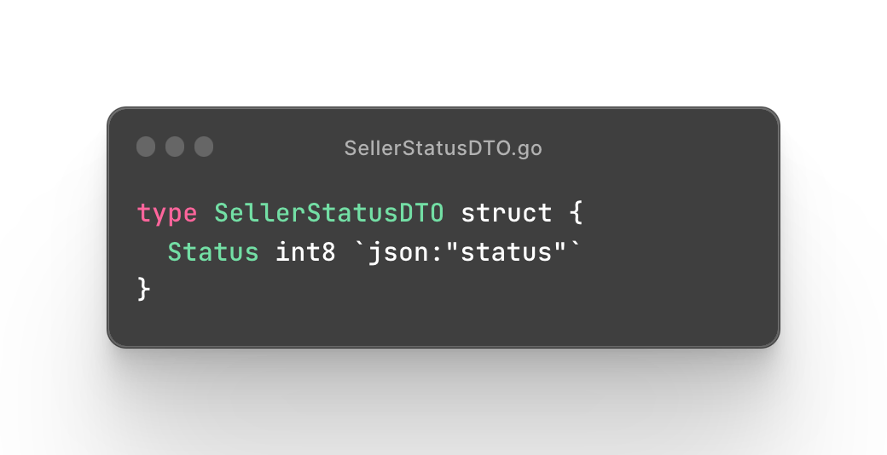
<!-- 
  1. Seller'ın statusüne ihtiyacı olan bir client sellerId ile birlikte gelip bunu almak istediğinde alltaki DTO ile dönüş yapabiliriz.
-->

---

- **Command Query Separation**, 1988 Bertrand Meyer.
- Martin Fowler, 2005
<!-- 
  1. 2005'te ise Martin Fowler nam-i diğer Uncle bob, CQS her zaman uygun olmayabilir.
    1. Creation işleminde bir hata olursa bunu dönmemiz gerekebilir.
    2. Veya creation başarılıysa client'a ürettiğimiz ID bilgisi lazım olabilir gibi de bir örnek sunuyor.
-->

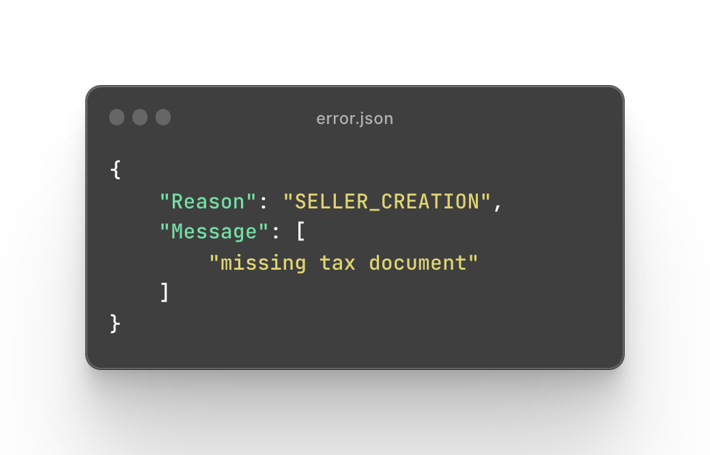

---

- **Command Query Separation**, 1988 Bertrand Meyer.
- Martin Fowler, 2005
<!-- 
  1. 2005'te ise Martin Fowler nam-i diğer Uncle bob, CQS her zaman uygun olmayabilir.
    1. Creation işleminde bir hata olursa bunu dönmemiz gerekebilir.
    2. Veya creation başarılıysa client'a ürettiğimiz ID bilgisi lazım olabilir gibi de bir örnek sunuyor.
-->

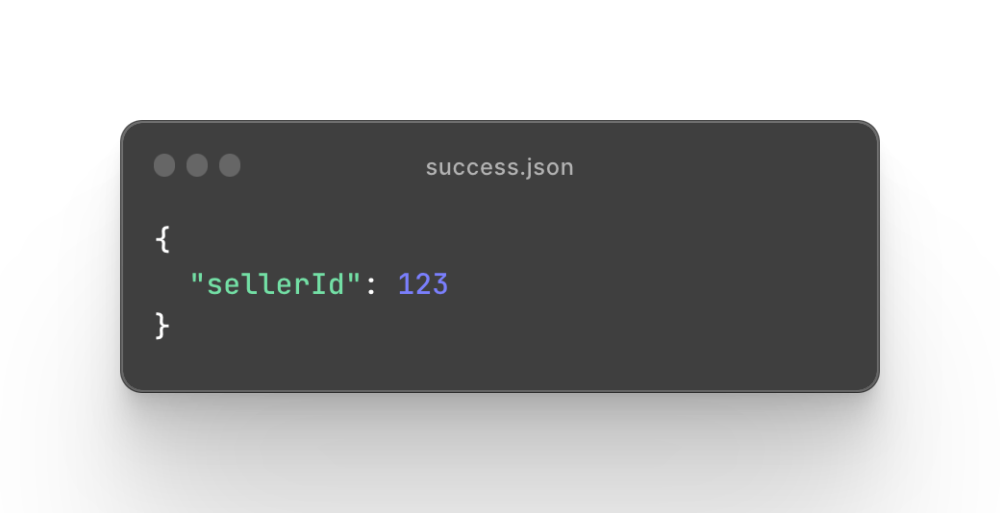

---

- Command Query **Responsibility** Separation, 2010 Greg Young.

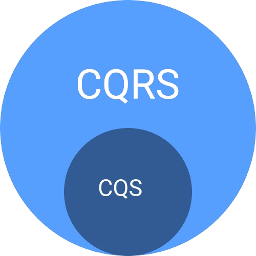
<!-- 
  1. 2010 yılında ise Greg Young CQS'i kapsayacak CQRS'i ortaya atıyor ve yapacağımız seperationda responsibility'i öne çıkarıyor. API, Domain, Model ve hatta Database'leri ayırmalıyız diyor.
-->

---

- Command Query **Responsibility** Separation, 2010 Greg Young.
- CQRS is not silver bullet
<!-- 
  1. Her şey çok güzel gözükse de CQRS tüm dertlerimize deva olacak bir pattern değil. Tüm dertlere deva olmak diye de bir şey yok zaten.
  2. Pattern'ları problem-solution şeklinde düşünmeliyiz.
-->

---
###### What is the problem here?
<!-- 
  1. Sellerla ilgili read&write işlemleri yapan bir servisim olsun.
  2. En basit tasarımıyla bir şeyler create ediliyor, daha sonra create edilen şeyler read ediliyor.
  3. Problemimiz nedir bu tasarımda?
    1. Projemin complexitysi arttıkça logicler birbirine girecek, ekip çalıştığı tasklarda conflictler yaşamaya başlayacak, ÇÜNKÜ read ve write işlemlerini hep bir yerden yönetiyorum.
-->

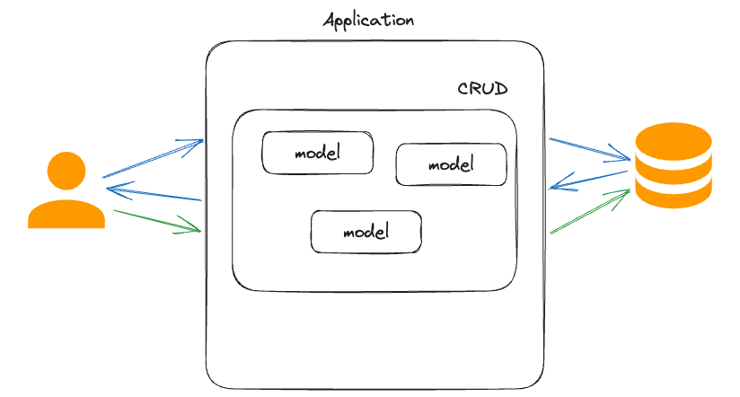 

---
###### It's the solution...
<!-- 
  1. Command ve Query'leri sadece DTO olarak değil, tüm iş akışlarını ayırarak burayı çözmüş oluyoruz.
  2. Bu çözüm ile SOLID'i de yaklaşmış oluyoruz, Single Responsibility.
-->

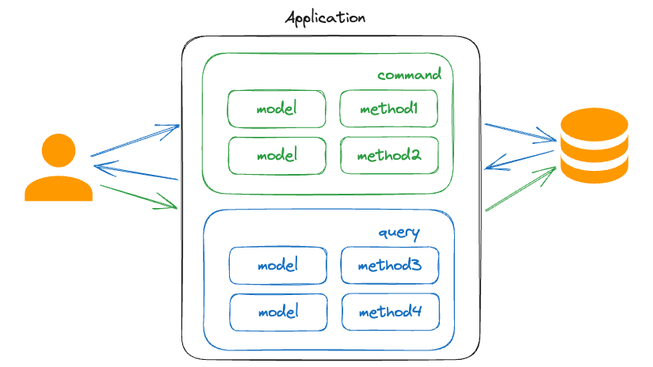 

---
###### Problem?
<!-- 
  1. Uygulamamdaki yüküm giderek artıyor ve performans problemleri yaşamaya başlıyorum.
  2. Response timelarım artıyor, clientlar timeout almaya başlıyor vs.
  3. İlk aklıma gelen uygulamayı scale etmek oluyor ama inceleme yaparken read'in write'tan daha fazla arttığını gözlemliyorum.
    1. Ki gerçek hayattaki senaryolarımız da tam olarak böyle gerçekleşiyor. write read'e eşit veya büyük olursa zaten gereksiz data mı tutuyorum sorusu akla gelir.
  4. Read'i hızlandırmak için DB'ye Index atmam gerekiyor ama bu da Write'ı yavaşlatacak.
  5. Bir performans problemini çözeyim derken başka bir probleme sebep olacağım.
-->

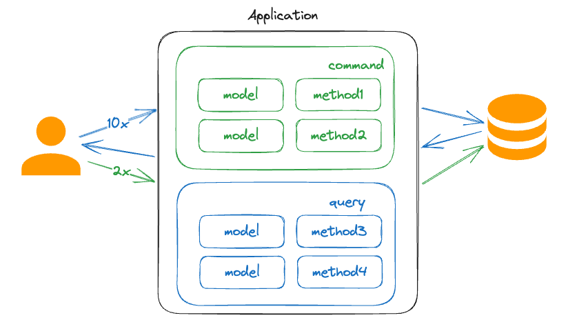 

---
###### Solution is...
<!-- 
  1. CQRS patterndaki responsibilityleri ayrıştırmayı uygulayabilir miyim diye düşünüyorum ve DB'leri
  ayırıyorum.
  2. Write'ın performansı benim concernlerimden birisiydi, ayrı bir DB'den yapıldığı için o kısım as-is hızıyla devam edecek.
  3. Read yükümü de karşılayan örneğin Elasticsearch DB'leri olacak.
  4. Artık neye ihtiyacım varsa o kısmı istediğim gibi scale edebileceğim.
  5. Peki, bu tasarımda düşünmem gereken bir trade-off var. Var mı yorumu olan? Atış serbest :)
-->

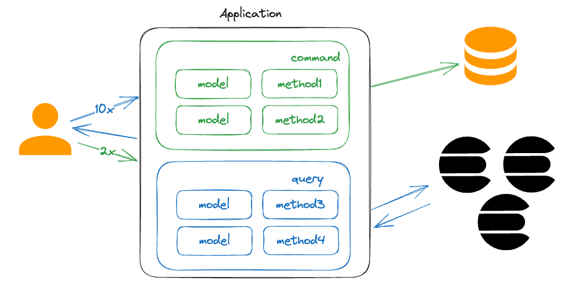 

---
###### Problem again, huh?
<!-- 
  1. Bir DB'ye yazıp, başka bir yerden onu eş zamanlı nasıl okuyacağım?
  2. DB'leri sync etmem gerekecek. Peki, consistency anlık sağlanabilecek mi?
  3. Yani yazdığım bir veriyi aynı millisaniye içerisinde elasticsearchten okuyabilecek miyim?
-->

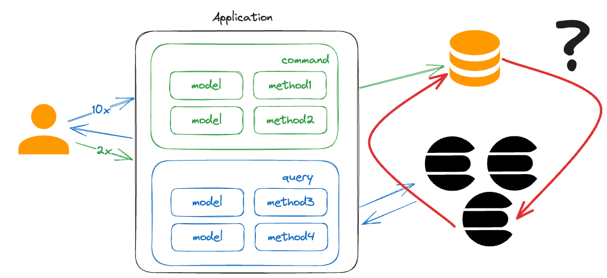 

---
###### Problem again, huh?
<!-- 
  1. Öncelikle bizim ekipte uygulamadığımız çözümden bahsedeyim. DB olarak Couchbase kullanıyoruz ve bu verileri Elasticsearch ile bir connector yardımıyla sync ediyoruz.
  2. Sistem eventual olarak consistenct durumda olacak, bunu trade off olarak kabul ediyorum. Bu latency monitor ediyorum, artmasını önleyecek çözümler üretiyorum.
-->

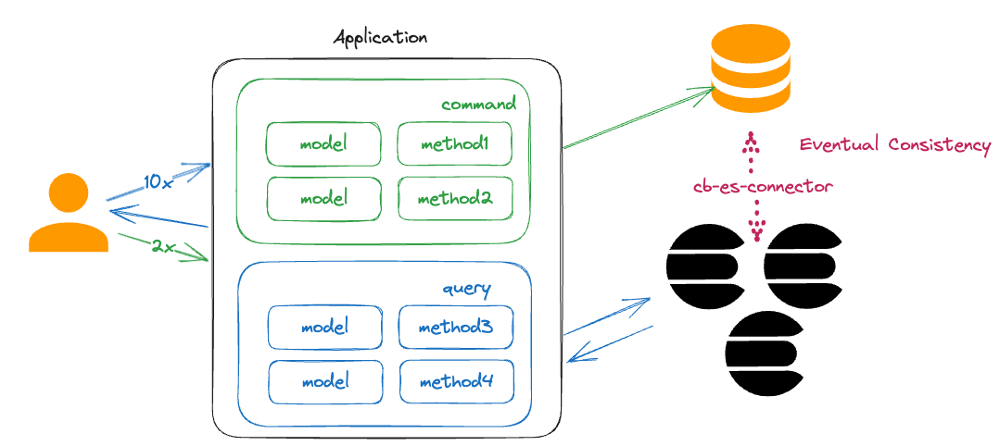 

---

##### When to use...
<!-- 
  1. Kısaca ne zaman kullanmalıyız kısmına bakalım
    1. Large scale olan ve performans gerektiren projelerde
    2. Business logiclerin complex olduğu projelerde
    3. Takım halinde çalışılan projelerde conflictleri ortadan kaldırmak gerektiğinde. Bazı tasklar command taskı olur bazıları query.
-->
- Large scale performance needed projects

---
##### When to use...

- Large scale performance needed projects
- Complex business requirements

---
##### When to use...

- Large scale performance needed projects
- Complex business requirements
- Avoiding conflicts in the team

---

##### When not to use...
<!--
  2. Ne zaman kullanmamalı
    1. CRUD app gibi basit olan uygulamalarda gerek yok.
    2. basit business logicler olan yerlerde gerek yok, overengineering olur. geliştirmeden daha çok vakit alır.
    3. CQRS tüm projelik bir çözüm olmayabilir. Belli bir contexte uygulanmalıdır ve gerçekten uygulama gerekliliği olmalıdır.
-->

- CRUD apps

---

##### When not to use...

- CRUD apps
- Basic Business Logics

---

##### When not to use...

- CRUD apps
- Basic Business Logics
- Not applied to whole project

---

##### When not to use...

- CRUD apps
- Basic Business Logics
- Not applied to whole project
- Project needed consistency

---

###### CQRS Summary
<!-- 
  1. Bu bölümde CQRS'in ne olduğuna, problem setine ve olası çözümlerine cevap bulmaya çalıştık.
-->

- What is CQRS?
- What is the problem?
- What are the solutions?
- When to use, when not?

---

# Agenda

 Introduction
 CQRS
 RDBMS vs NoSQL
 Break Time
 Why and When NoSQL
 Demo

---

<!-- _class: lead -->

# RDBMS vs NoSQL

---

#### RDBMS

- Relational Database Management System

---

#### RDBMS

- Relational Database Management System
- Table based

---

#### RDBMS

- Relational Database Management System
- Table based
- Stores data in the rows and columns

---

#### RDBMS

- Relational Database Management System
- Table based
- Stores data in the rows and columns
- Use **Structured Query Language**

---

#### RDBMS

- Relational Database Management System
- Table based
- Stores data in the rows and columns
- Use **Structured Query Language**
- MySQL, PostgreSQL, Microsoft SQL Server, Oracle, and Microsoft Access.

---

#### NoSQL

- Not Only SQL

---

#### NoSQL

- Not Only SQL
- Unstructured, schema-less data

---

#### NoSQL

- Not Only SQL
- Unstructured, schema-less data
- Document
  1. MongoDB
  2. CouchDB

---

#### NoSQL

- Not Only SQL
- Unstructured, schema-less data
- Document

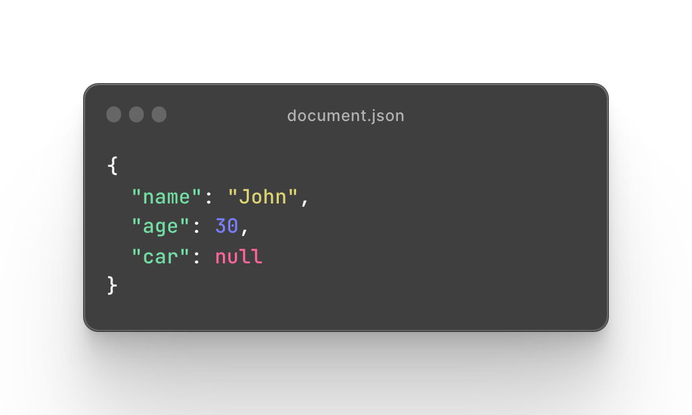 

---

#### NoSQL

- Not Only SQL
- Unstructured, schema-less data
- Document, Wide-Column Store
  1. HBase
  2. Cassandra
  3. Hypertable

---

#### NoSQL

- Not Only SQL
- Unstructured, schema-less data
- Document, Wide-Column Store

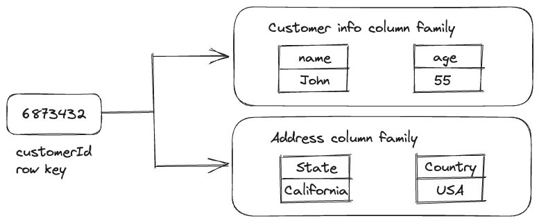 
<!-- 
  High volume of data
  Extreme write speeds with relatively less velocity reads
  Data extraction by columns using row keys
-->
---

#### NoSQL

- Not Only SQL
- Unstructured, schema-less data
- Document, Wide-Column Store, Graph
  1. Neo4J
  2. Infinite Graph
  3. OrientDB
  4. FlockDB

---

#### NoSQL

- Not Only SQL
- Unstructured, schema-less data
- Document, Wide-Column Store, Graph

<!-- 
  Applications where nested data needs to be fetched in a single call.
For example, a blog or social networking platform where posts need to be fetched along with nested comments and commenters details.
-->
---

#### NoSQL

- Not Only SQL
- Unstructured, schema-less data
- Document, Wide-Column Store, Graph, Key-Value
  1. Apache Cassandra
  2. Berkeley DB
  3. Couchbase Server
  4. Redis

---

#### NoSQL

- Not Only SQL
- Unstructured, schema-less data
- Document, Wide-Column Store, Graph, Key-Value

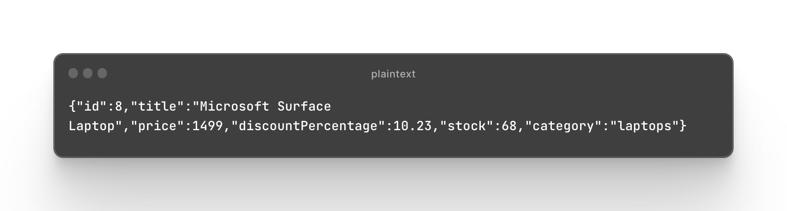

---

#### RDBMS Pros

- Great for structured data

---

#### RDBMS Pros

- Great for structured data
- Use of an existing query language (SQL)

---

#### RDBMS Pros

- Great for structured data 
- Use of an existing query language (SQL)
- Great for complex queries

---

#### RDBMS Pros

- Great for structured data 
- Use of an existing query language (SQL)
- Great for complex queries
- High level of data integration, due to relationships and constraints among tables

---

#### RDBMS Pros

- Great for structured data 
- Use of an existing query language (SQL)
- Great for complex queries
- High level of data integration, due to relationships and constraints among tables
- High reliability

---

#### RDBMS Cons

- Up-front schema definition

---

#### RDBMS Cons

- Up-front schema definition
- No adaptation for changes

---

#### RDBMS Cons

- Up-front schema definition
- No adaptation for changes
- High performance is expensive

---

#### RDBMS Cons

- Up-front schema definition
- No adaptation for changes
- High performance is expensive
- Horizontal scale

---

#### NoSQL Pros

- Flexible data model

---

#### NoSQL Pros

- Flexible data model
- Rapid adaptation for changes

---

#### NoSQL Pros

- Flexible data model
- Rapid adaptation for changes
- High Performance with less money

---

#### NoSQL Pros

- Flexible data model
- Rapid adaptation for changes
- High Performance with less money
- Scalability

---

# Agenda

 Introduction
 CQRS
 RDBMS vs NoSQL
 Break Time
 Why and When NoSQL
 Demo

---

<!-- _class: lead -->

# Break Time

---

# Agenda

 Introduction
 CQRS
 RDBMS vs NoSQL
 Break Time
 Why and When NoSQL
 Demo

---

<!-- _class: lead -->

# Why and When NoSQL

---

### Why and When NoSQL

- Fast lead time

---

### Why and When NoSQL

- Fast lead time
- Eventual Consistency Over Strong Consistency

---

### Why and When NoSQL

- Fast lead time
- Eventual Consistency Over Strong Consistency
- Big Data

---

### Why and When NoSQL

- Fast lead time
- Eventual Consistency Over Strong Consistency
- Big Data
- Read performance

---

### Why and When NoSQL

- Fast lead time
- Eventual Consistency Over Strong Consistency
- Big Data
- Read performance
- High availability

---

# Agenda

 Introduction
 CQRS
 RDBMS vs NoSQL
 Break Time
 Why and When NoSQL
 Demo

---

<!-- _class: lead -->

# Demo

---

<!-- _class: lead -->

Thank you